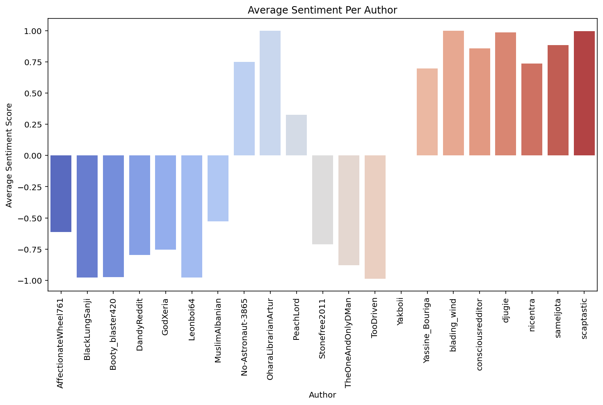

# One Piece subreddit network analysis

## Description
This project aims at studying the network dynamics of a subreddit online. The subreddit chosen is the OnePiece subreddit and in order to study user engagement, user sentiments and network dynamics some python libraries have been used such as PRAW, Pandas, VADER Sentiment Analysis and Networkx. 

This project explores the dynamics of social interactions and sentiment propagation within the r/OnePiece subreddit through network analysis. Sentiment analysis to classify textual data into positive, negative and neutral has been performed gathering data from posts and comments from the aforementioned subreddit. Two kinds of network were constructed and studied: a bipartite graph linking posts and commenters and a network made of commenters only highlighting shared activities within the subreddit. 

Key analysis investigated were community detection, centrality measures and sentiment propagation modelling; distinct clusters were identified and some of them show a notable inter-community sentiment flow visualized through a heatmap. 

This small study was an excercise to demonstrate the applicability of network analysis to real-world social data coming from online interactions and aiming at understanding these better. 

This project lays a foundation for further targeted investigations into specific aspects, such as temporal dynamics of sentiment during key One Piece events. It still comes with some limitations such as a limited size for the number of posts obtained, limited perspectives that may be due to the analysis of only one subreddit about this topic, the parameters for the sentiment propagation model were chosen in heuristic way and the sentiment analysis tool is lexycon based. 

---

## Table of contents
- [Setup](#setup)

- [Installation](#installation)
  
- [Usage](#usage)

- [Examples](#examples)

---

## Setup
This project was developed in an Anaconda environment, but a standard Python virtual environment (venv) will also work. 

1. **Install git (if not installed)**:
   
   Git is needed to clone the repository. Install it from https://git-scm.com/downloads and check the installation with:
```bash
git --version
```

2. **Create an environment for the project**:

For Anaconda users, open the Anaconda Prompt and type:
```bash
conda create --name my_project_env python=3.9
conda activate my_project_env
```

For standard virtual environment users, open a Windows terminal and type:
```bash
python -m venv my_project_env
source my_project_env/bin/activate  # On Windows, use: my_project_env\Scripts\activate
```

## Installation
1. **Clone the repository**:

   Open Git Bash (Windows) or Terminal (Mac/Linux) and run:
   
```bash
   git clone https://github.com/StefanoSpadano/complex_networks_project.git
   cd complex_networks_project
```
2. **Install dependencies used in this project**
```bash
pip install -r requirements.txt
```
3. Once you have created a Reddit account you can go to https://www.reddit.com/prefs/apps and click on:

- "Create an app" or "Create another app";

- select script as the app type since we are using [PRAW](https://praw.readthedocs.io/en/stable/index.html) and not a web app;

- fill in:

  - app name (for example OnePiece scraper);
  
  - set Redirect URI to "http://localhost:8080";
  
  - leave other fields empty.

After submitting these spaces you will get access to:

- Client ID (a short alphanumeric string);

- Client secret (a long alphanumeric string).


4. A config.py file is needed to store your Reddit credentials to start the data scraping process using the PRAW library. Create a python file naming it "config.py" and save it in the project folder then proceed to add your credentials just retrieved into it in the following way:
## config.py
REDDIT_CLIENT_ID = "your-client-id"

REDDIT_CLIENT_SECRET = "your-client-secret"

REDDIT_USER_AGENT = "your-user-agent"

## Usage 
Scripts can be run individually to perform different stages of the analysis.

- data_collection.py: collects posts and comments from the subreddit saving them in a folder called data;
- analize_metrics.py: calculates some metrics such as number of comments, number of upvotes and number of unique commenters;
- analize_sentiment.py: investigates sentiment distribution across posts;
- analize_comment_sentiment.py: investigates comment's sentiment for each post;
- network_aspects.py: takes care of visualization of the two different types of network and their features.

**For Anaconda and Spyder users** you can simply open each script in Spyder and run it pressing F5, just make sure to activate the correct environment before.

**For standard Python users** you can run the scripts from your terminal or command prompt, just make sure to be in the root folder of the cloned repository before running the following commands:

```bash
python data_collection.py
python analize_metrics.py
python analize_sentiment.py
python analize_comment_sentiment.py
python network_aspects.py
```

## Examples
1. data_collection.py
```bash
python data_collection.py

It appears that you are using PRAW in an asynchronous environment.
It is strongly recommended to use Async PRAW: https://asyncpraw.readthedocs.io.
See https://praw.readthedocs.io/en/latest/getting_started/multiple_instances.html#discord-bots-and-asynchronous-environments for more info.

Saving collected data...
Data collection complete. Posts and comments have been saved.
```

2. analize_metrics.py
```bash
python analize_metrics.py

Post Metrics:
   post_id             author  ...  total_posts  unique_commenters
0   pof2r4   Any_Plantain_872  ...            1                485
1   pz6fk7          Leonboi64  ...            1                704
2   tokct1       blading_wind  ...            1                752
3   qs42bo  consciousredditor  ...            1                254
4  1inrb3e      Stonefree2011  ...            1                185

[5 rows x 11 columns]

Comment Metrics:
               author  total_comments
0          --Azazel--               4
1  --Imhighrightnow--               1
2             -ALLDAY               1
3          -BigHarry-              26
4     -Buggy-D-Clown-               1
Metrics DataFrames saved.
```
3. analize_sentiment.py
   

5. 
6. 
7. 
8. 
