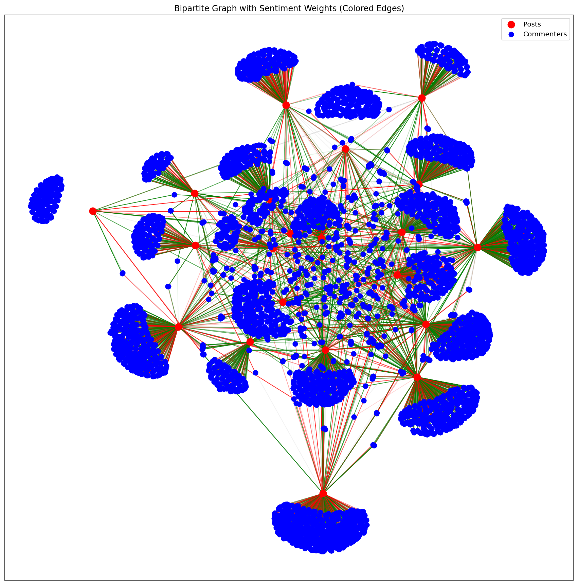

# A subreddit network analysis

A network and sentiment analysis project based on user interactions in a given subreddit.

## Description
This project aims at studying the network dynamics of a subreddit online. The subreddit chosen from the start was the the OnePiece subreddit but later on the project was extended to ask the user to prompt the subreddit to analyze. In order to study user engagement, user sentiments and network dynamics some python libraries have been used such as PRAW, Pandas, VADER Sentiment Analysis and Networkx. 

This project explores the dynamics of social interactions and sentiment propagation within a subreddit through network analysis. Sentiment analysis to classify textual data into positive, negative and neutral has been performed gathering data from posts and comments from a subreddit. Two kinds of network were constructed and studied: a bipartite graph linking posts and commenters and a network made of commenters only highlighting shared activities within the subreddit. 

Key analysis investigated were community detection, centrality measures and sentiment propagation modelling; distinct clusters were identified and some of them show a notable inter-community sentiment flow visualized through a heatmap. 

This small study demonstrates how network analysis can help understand real-world social data derived from online interactions.

This project lays a foundation for further targeted investigations into specific aspects, such as temporal dynamics of sentiment during key events. It still comes with some limitations such as a limited size for the number of posts obtained, limited perspectives that may be due to the analysis of only one subreddit at time, the parameters for the sentiment propagation model were chosen in heuristic way and the sentiment analysis tool is lexicon based. 

---

## Table of contents
- [Installation](#installation)

- [Setup](#setup)
  
- [Usage](#usage)

- [Examples](#examples)

- [Tests](tests)

---

## Installation
This project was developed in Python (version 3.9 or higher needed) using an Anaconda environment, but a standard Python virtual environment (venv) will also work. 

1. **Install git (if not installed)**:
   
   Git is needed to clone the repository. Install it from https://git-scm.com/downloads and check the installation with:
```bash
git --version
```

2. **Clone the repository**:

   Open Git Bash (Windows) or Terminal (Mac/Linux) and run:
   
```bash
   git clone https://github.com/StefanoSpadano/complex_networks_project.git
   cd complex_networks_project
```
3. **Create an environment for the project**:

For Anaconda users, open the Anaconda Prompt move into the cloned folder and type:
```bash
conda create --name my_project_env python=3.9
conda activate my_project_env
```

For standard virtual environment users, open a terminal (Command Prompt or shell), move into the downloaded folder, and create a virtual environment:
```bash
python -m venv my_project_env
```

Then activate it:

-On macOS/Linux:
```bash
source my_project_env/bin/activate
```
-On Windows (Command Prompt):
```bash
my_project_env\Scripts\activate.bat
```
4. **Install dependencies used in this project**
If using conda, you can install the dependencies with:
```bash
conda install --file requirements.txt
```
Otherwise:
```bash
pip install -r requirements.txt
```


## Setup

A [Reddit](https://www.reddit.com/) account is needed for the collection of data from the subreddit chosen. 

Once you have created a Reddit account you can go to https://www.reddit.com/prefs/apps and click on:

- "Create an app" or "Create another app";

- select script as the app type since we are using [PRAW](https://praw.readthedocs.io/en/stable/index.html) and not a web app;

- fill in:

  - app name (for example OnePieceScraper);
  
  - set Redirect URI to "http://localhost:8080";
  
  - leave other fields empty.

After submitting these spaces you will get access to:

- Client ID (a short alphanumeric string);

- Client secret (a long alphanumeric string).


To configure the project, copy the provided sample_config.ini file to config.ini, make sure you are in the root folder of the cloned repository (the one containing sample_config.ini) before running:

```bash
cp sample_config.ini config.ini
```

This will create a new file called config.ini pre-filled with placeholder values. Open it in a text editor and replace the placeholders with your Reddit API credentials.

## config.ini
client_id = "your-client-id"

client_secret = "your-client-secret"

user_agent = "your-user-agent" **Here you should insert the name of your app followed by " by /u/yourusername"**

subreddit = "the name of the subreddit you'd like to scrape"

flairs = "flairs you are interested in"

post_output_file = "../path/to/your/post/file.csv"

comment_output_file = "../path/to/yout/comment/file.csv"

If the subreddit and flairs fields are left empty then the user will be asked to insert them when launching the data_collection.py file. The user can insert them when having a default subreddit to scrape. The paths are created if they are not already present and named after the subreddit chosen.

## Usage 
Scripts can be run individually to perform different stages of the analysis but the first time you try to launch them they must be run in the shown order as the first two scripts are responsible for data collection and manipulation of dataframes obtained.

- data_collection.py: can be used with a command line argument specifying subreddit and flairs when launching the script:
```bash
python data_collection.py --subreddit OnePiece --flairs Theory,Analysis
```
For a first time usage you can launch it as it is without filling the [defaults] placeholders and the script will ask the user to insert manually the subreddit name and then let you pick the flairs obtained from that fetch; if you filled the flairs and subreddit name spaces in the config.ini file then those will be used.
The script then fetches top posts, and their comments, from the subreddit chosen.
- analize_metrics.py: calculates some metrics such as number of comments, number of upvotes and number of unique commenters;
- analize_sentiment.py: investigates sentiment distribution across posts;
- analize_comment_sentiment.py: investigates comment's sentiment for each post;
- network_aspects.py: takes care of visualization of the two different types of network and their features.

The last three scripts produce some plots which will be saved in a dedicated folder for plots and each plot is saved with its name and a time stamp.

For a first time usage I advise using the scripts are they are and each time you'll be prompted to insert the subreddit name upon which the script has to be run; this will create coherence among the files saved and imported. If users want to work only on one subreddit then the info can be inserted in the config.ini file directly.

**For standard Python users** you can run the scripts from your terminal or command prompt, just make sure to be in the root folder of the cloned repository before running the following commands:

```bash
python data_collection.py
python analize_metrics.py
python analize_sentiment.py
python analize_comment_sentiment.py
python network_aspects.py
```

## Examples
1. data_collection.py
```bash
python data_collection.py

Fetching posts from r/OnePiece...

Found these flairs in the top 25 posts:
1. Analysis
2. Cosplay
3. Current Chapter
4. Discussion
5. Fanart
6. Media

Enter flairs to include (e.g., 1,3 or type names, press Enter for all): 1, 3, 4

Fetching comments for each post...

Saving collected data...

✅ Data collection complete.
Posts saved to ../data/onepiece_posts.csv
Comments saved to ../data/onepiece_comments.csv
```

2. analize_metrics.py
```bash
python analize_metrics.py

Post Metrics:
   post_id             author  ...  total_posts  unique_commenters
0   pof2r4   Any_Plantain_872  ...            1                485
1   pz6fk7          Leonboi64  ...            1                704
2   tokct1       blading_wind  ...            1                752
3   qs42bo  consciousredditor  ...            1                254
4  1inrb3e      Stonefree2011  ...            1                185

[5 rows x 11 columns]

Comment Metrics:
               author  total_comments
0          --Azazel--               4
1  --Imhighrightnow--               1
2             -ALLDAY               1
3          -BigHarry-              26
4     -Buggy-D-Clown-               1
Metrics DataFrames saved.
```
3. analize_sentiment.py
   

5. network_aspects.py




## Tests
I developed a suite of tests to verfy the correctness and functionalities exploited in the last scripts. Tests can be run with the following command, just remember to be in the root folder of the project:
```bash
python -m pytest tests
```
or if you are interested in a specific module:
```bash
python -m pytest tests\test_data_collection.py
```
## 🛠 What the Tests Cover

### ✅ Data Collection
- Verifies saving posts/comments to CSV works correctly.
- Handles empty datasets gracefully.
- Ensures flair selection behaves as expected.

### ✅ Sentiment Analysis
- Tests sentiment computation even for edge cases (e.g., empty text, constant sentiment).
- Checks cleaned sentiment data merges properly with post metrics.

### ✅ Network Analysis
- Validates graph creation and metric calculations for small datasets.
- Ensures community detection and centrality measures run without errors.

---

### ⚠ Notes
- Make sure to set up the Python environment (`requirements.txt`) before running tests.
- Some tests use **temporary directories** and **mock Reddit API calls**, so **no live Reddit requests** are made during testing.
- If you add or change scripts, update or add tests in the `tests/` directory accordingly.
- Some early test scripts (e.g., `test_fetch_posts.py`) were kept in the repo for reference, but are not used in the final test suite.


## Issues encountered while testing on macOS

If you encounter timeouts or DNS issues when connecting to Reddit utilizing the first script data_collection.py:
- Try pinging Reddit from your terminal: `ping reddit.com` and check if you see something like 'Request timeout' or '0 packs receveid'.
- If so, a workaround that worked for me was switching DNS from my wi-fi settings to 8.8.8.8 (Google DNS).


The script includes an exponential backoff retry mechanism, but unresolved DNS cannot be handled in code.


## Known Issues & Future Improvements

- 🏷 **Flair Handling**
  - Posts without flairs are included under “allflairs”, which may affect dataset naming and later analysis steps.
  - Flair names are not currently sanitized for special characters in filenames.

- 📊 **Dataset Size**
  - Analysis scripts may skip plotting or correlations if the dataset is too small (e.g., <5 posts).

- 🌐 **Rate Limiting**
  - Reddit API rate limits can slow down comment fetching, especially on large subreddits. Implementing async fetching or better exponential backoff could help.

- 📂 **File Naming Consistency**
  - Filenames depend on subreddit and flair selections, which can lead to unexpected results if users provide overlapping or ambiguous flairs.

- 🔧 **CLI/Config Flow**
  - Some command-line arguments override config settings in unexpected ways. Better validation and clearer user prompts are planned.

---

### ✅ Planned Improvements
- Save plots consistently for all scripts (not just network analysis).
- Add summary statistics after data collection (e.g., number of posts/comments per flair).


 
 
